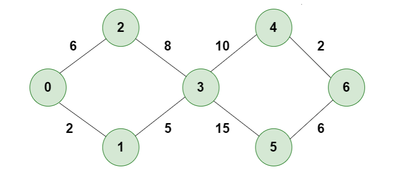
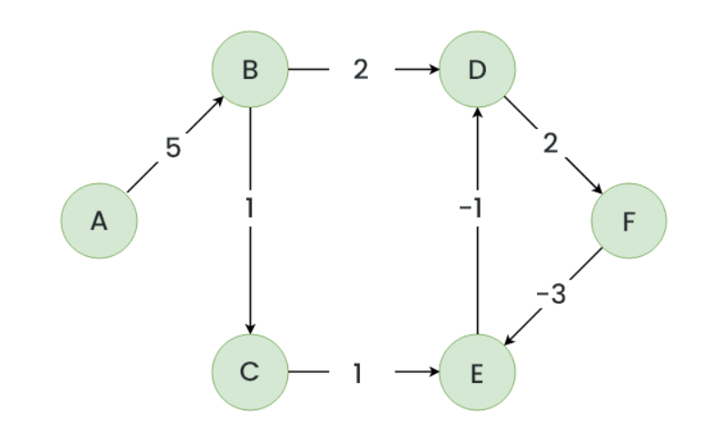
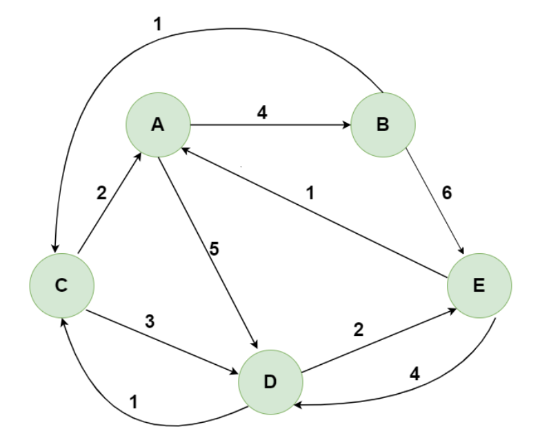
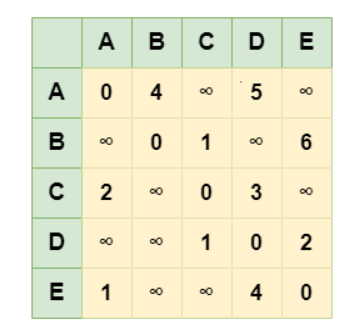
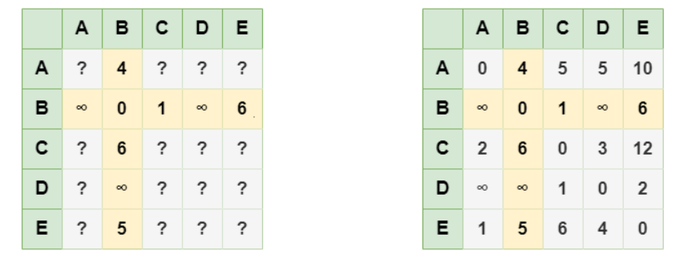
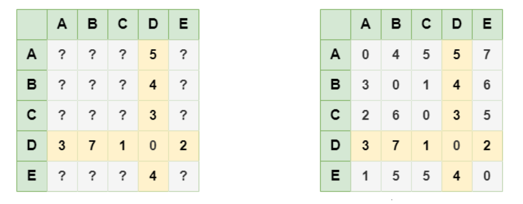
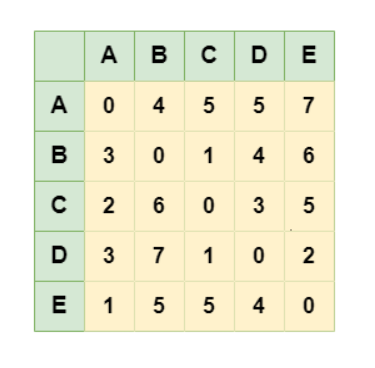

# Graph Data Stucture

Graph is a non-linear data structure consisting of vertices and edges. It is a powerful tool for representing and analyzing complex relationships between objects or entities.

## Components of a Graph 

1. **Vertices:** Vertices are the fundamental units of the graph. Sometimes, vertices are also known as vertex or nodes. Every node/vertex can be labeled or unlabeled.

2. **Edges:** Edges are drawn or used to connect two nodes of the graph. It can be ordered pair of nodes in a directed graph. Edges can connect any two nodes in any possible way. There are no rules. very edge can be labelled/unlabelled.

## Basic Operations on Graphs
- Insertion of Nodes/Edges in the graph
- Deletion of Nodes/Edges in the graph
- Searching on Graphs 
- Traversal of Graphs

## Types of Graph 


**1. Undirected Graph:** In an undirected graph, edges have no direction, and they represent symmetric relationships between nodes. If there is an edge between node A and node B, you can travel from A to B and from B to A.

**2. Directed Graph (Digraph):** In a directed graph, edges have a direction, indicating a one-way relationship between nodes. If there is an edge from node A to node B, you can travel from A to B but not necessarily from B to A.

**3. Weighted Graph:** In a weighted graph, edges have associated weights or costs. These weights can represent various attributes such as distance, cost, or capacity. Weighted graphs are commonly used in applications like route planning or network optimization.

**4. Cyclic Graph:** A cyclic graph contains at least one cycle, which is a path that starts and ends at the same node. In other words, you can traverse the graph and return to a previously visited node by following the edges.

**5. Acyclic Graph:** An acyclic graph, as the name suggests, does not contain any cycles. This type of graph is often used in scenarios where a cycle would be nonsensical or undesirable, such as representing dependencies between tasks or events.

**6. Tree:** A tree is a special type of acyclic graph where each node has a unique parent except for the root node, which has no parent. Trees have a hierarchical structure and are frequently used in data structures like binary trees or decision trees.

## Representation of Graphs
There are two ways to store a graph:

1. **Adjacency Matrix:**
In this method, the graph is stored in the form of the 2D matrix where rows and columns denote vertices. Each entry in the matrix represents the weight of the edge between those vertices. 

```python
def create_adjacency_matrix(graph):
    num_vertices = len(graph)

    adj_matrix = [[0] * num_vertices for _ in range(num_vertices)]

    for i in range(num_vertices):
        for j in range(num_vertices):
            if graph[i][j] == 1:
                adj_matrix[i][j] = 1
                adj_matrix[j][i] = 1

    return adj_matrix


graph = [
    [0, 1, 0, 0],
    [1, 0, 1, 0],
    [0, 1, 0, 1],
    [0, 0, 1, 0]
]

adj_matrix = create_adjacency_matrix(graph)

for row in adj_matrix:
    print(' '.join(map(str, row)))

```

2. **Adjacency List:**
In this method, the graph is represented as a collection of linked lists. There is an array of pointer which points to the edges connected to that vertex. 

```python
def create_adjacency_list(edges, num_vertices):
    adj_list = [[] for _ in range(num_vertices)]

    for u, v in edges:
        adj_list[u].append(v)
        adj_list[v].append(u)

    return adj_list

if __name__ == "__main__":
    num_vertices = 4
    edges = [(0, 1), (0, 2), (1, 2), (2, 3), (3, 1)]

    adj_list = create_adjacency_list(edges, num_vertices)

    for i in range(num_vertices):
        print(f"{i} -> {' '.join(map(str, adj_list[i]))}")
```
`Output`
`0 -> 1 2` 
`1 -> 0 2 3` 
`2 -> 0 1 3`
`3 -> 2 1 `


# Traversal Techniques 

## Breadth First Search (BFS) 
- It is a graph traversal algorithm that explores all the vertices in a graph at the current depth before moving on to the vertices at the next depth level. 
- It starts at a specified vertex and visits all its neighbors before moving on to the next level of neighbors. 
BFS is commonly used in algorithms for pathfinding, connected components, and shortest path problems in graphs.

**Steps of BFS algorithms**


- **Step 1:** Initially queue and visited arrays are empty.
- **Step 2:** Push node 0 into queue and mark it visited.
- **Step 3:** Remove node 0 from the front of queue and visit the unvisited neighbours and push them into queue.
- **Step 4:** Remove node 1 from the front of queue and visit the unvisited neighbours and push them into queue.
- **Step 5:** Remove node 2 from the front of queue and visit the unvisited neighbours and push them into queue.
- **Step 6:** Remove node 3 from the front of queue and visit the unvisited neighbours and push them into queue. 
- **Step 7:** Remove node 4 from the front of queue and visit the unvisited neighbours and push them into queue. 

```python

from collections import deque

def bfs(adjList, startNode, visited):
    q = deque()

    visited[startNode] = True
    q.append(startNode)

    while q:
        currentNode = q.popleft()
        print(currentNode, end=" ")

        for neighbor in adjList[currentNode]:
            if not visited[neighbor]:
                visited[neighbor] = True
                q.append(neighbor)

def addEdge(adjList, u, v):
    adjList[u].append(v)

def main():
    vertices = 5

    adjList = [[] for _ in range(vertices)]

    addEdge(adjList, 0, 1)
    addEdge(adjList, 0, 2)
    addEdge(adjList, 1, 3)
    addEdge(adjList, 1, 4)
    addEdge(adjList, 2, 4)

    visited = [False] * vertices

    print("Breadth First Traversal", end=" ")
    bfs(adjList, 0, visited)

if __name__ == "__main__": #Output : Breadth First Traversal 0 1 2 3 4
    main()     

```

- **Time Complexity:** `O(V+E)`, where V is the number of nodes and E is the number of edges.
- **Auxiliary Space:** `O(V)`


## Depth-first search 

Depth-first search is an algorithm for traversing or searching tree or graph data structures. The algorithm starts at the root node (selecting some arbitrary node as the root node in the case of a graph) and explores as far as possible along each branch before backtracking.

**Steps of DFS algorithms**

- **Step 1:** Initially stack and visited arrays are empty.
- **Step 2:** Visit 0 and put its adjacent nodes which are not visited yet into the stack.
- **Step 3:** Now, Node 1 at the top of the stack, so visit node 1 and pop it from the stack and put all of its adjacent nodes which are not visited in the stack.
- **Step 4:** Now, Node 2 at the top of the stack, so visit node 2 and pop it from the stack and put all of its adjacent nodes which are not visited (i.e, 3, 4) in the stack.
- **Step 5:** Now, Node 4 at the top of the stack, so visit node 4 and pop it from the stack and put all of its adjacent nodes which are not visited in the stack.
- **Step 6:** Now, Node 3 at the top of the stack, so visit node 3 and pop it from the stack and put all of its adjacent nodes which are not visited in the stack.


```python
from collections import defaultdict

class Graph:

	def __init__(self):
		self.graph = defaultdict(list)

	def addEdge(self, u, v):
		self.graph[u].append(v)

	def DFSUtil(self, v, visited):
		visited.add(v)
		print(v, end=' ')

		for neighbour in self.graph[v]:
			if neighbour not in visited:
				self.DFSUtil(neighbour, visited)

	def DFS(self, v):
		visited = set()
		self.DFSUtil(v, visited)

if __name__ == "__main__":
	g = Graph()
	g.addEdge(0, 1)
	g.addEdge(0, 2)
	g.addEdge(1, 2)
	g.addEdge(2, 0)
	g.addEdge(2, 3)
	g.addEdge(3, 3)

	print("Depth First Traversal (starting from vertex 2): ",g.DFS(2)) 

```
`Output: Depth First Traversal (starting from vertex 2): 2 0 1 3 `

- **Time complexity:** `O(V + E)`, where V is the number of vertices and E is the number of edges in the graph.
- **Auxiliary Space:** `O(V + E)`, since an extra visited array of size V is required, And stack size for iterative call to DFS function.


<br>


# Shortest Path Algorithm

# Dijkstra’s Algorithm

Dijkstra’s algorithm is a popular algorithms for solving many single-source shortest path problems having non-negative edge weight in the graphs i.e., it is to find the shortest distance between two vertices on a graph. 


## Working of Dijkstra's Algorithm
The algorithm will generate the shortest path from node 0 to all the other nodes in the graph.




For this graph, we will assume that the weight of the edges represents the distance between two nodes.

As, we can see we have the shortest path from, <br>
Node 0 to Node 1, from <br>
Node 0 to Node 2, from <br>
Node 0 to Node 3, from<br>
Node 0 to Node 4, from<br>
Node 0 to Node 6.<br>

Initially we have a set of resources given below :

- The Distance from the source node to itself is 0. In this example the source node is 0.
- The distance from the source node to all other node is unknown so we mark all of them as infinity.<br>
Example: 0 -> 0, 1 -> ∞, 2 -> ∞, 3 -> ∞, 4 -> ∞, 5 -> ∞, 6 -> ∞.

- We’ll also have an array of unvisited elements that will keep track of unvisited or unmarked Nodes.
- Algorithm will complete when all the nodes marked as visited and the distance between them added to the path. <br>
Unvisited Nodes:- 0 1 2 3 4 5 6.

`Step 1:` Start from Node 0 and mark Node as visited.

`Step 2:` Check for adjacent Nodes, Now we have to choices (Either choose Node1 with distance 2 or either choose Node 2 with distance 6 ) and choose Node with minimum distance. In this step Node 1 is Minimum distance adjacent Node, so marked it as visited and add up the distance.

Distance: Node 0 -> Node 1 = 2

`Step 3:`  Then Move Forward and check for adjacent Node which is Node 3, so marked it as visited and add up the distance, Now the distance will be:

Distance: Node 0 -> Node 1 -> Node 3 = 2 + 5 = 7


`Step 4:` Again we have two choices for adjacent Nodes (Either we can choose Node 4 with distance 10 or either we can choose Node 5 with distance 15) so choose Node with minimum distance. In this step Node 4 is Minimum distance adjacent Node, so marked it as visited and add up the distance.

Distance: Node 0 -> Node 1 -> Node 3 -> Node 4 = 2 + 5 + 10 = 17

`Step 5:`  Again, Move Forward and check for adjacent Node which is Node 6, so marked it as visited and add up the distance, Now the distance will be:

Distance: Node 0 -> Node 1 -> Node 3 -> Node 4 -> Node 6 = 2 + 5 + 10 + 2 = 19

So, the Shortest Distance from the Source Vertex is 19 which is optimal one.


## Implemention of Dijkstra’s Algorithm:

There are several ways to Implement Dijkstra’s algorithm, but the most common ones are:

1. Priority Queue (Heap-based Implementation)
2. Array-based Implementation


### Priority Queue

Below is the algorithm based on the above idea: 

- Initialize the distance values and priority queue.
- Insert the source node into the priority queue with distance 0.
- While the priority queue is not empty:
- Extract the node with the minimum distance from the priority queue.
- Update the distances of its neighbors if a shorter path is found.
- Insert updated neighbors into the priority queue.

**Python implementation of Dijkstra Algorithm**

```python
import heapq

class Node:
    def __init__(self, v, distance):
        self.v = v
        self.distance = distance

    def __lt__(self, other):
        return self.distance < other.distance

def dijkstra(V, adj, S):
    visited = [False] * V
    map = {}
    q = []

    map[S] = Node(S, 0)
    heapq.heappush(q, Node(S, 0))

    while q:
        n = heapq.heappop(q)
        v = n.v
        distance = n.distance
        visited[v] = True

        adjList = adj[v]
        for adjLink in adjList:
            if not visited[adjLink[0]]:
                if adjLink[0] not in map:
                    map[adjLink[0]] = Node(v, distance + adjLink[1])
                else:
                    sn = map[adjLink[0]]
                    if distance + adjLink[1] < sn.distance:
                        sn.v = v
                        sn.distance = distance + adjLink[1]
                heapq.heappush(q, Node(adjLink[0], distance + adjLink[1]))

    result = [0] * V
    for i in range(V):
        result[i] = map[i].distance

    return result

def main():
    adj = [[] for _ in range(6)]

    V = 6
    E = 5
    u = [0, 0, 1, 2, 4]
    v = [3, 5, 4, 5, 5]
    w = [9, 4, 4, 10, 3]

    for i in range(E):
        edge = [v[i], w[i]]
        adj[u[i]].append(edge)

        edge2 = [u[i], w[i]]
        adj[v[i]].append(edge2)

    S = 1

    result = dijkstra(V, adj, S)
    print(result)

if __name__ == "__main__":
    main()
```

- **Time complexity:** `O((V + E) log V)`
- **Auxiliary Space:** `O(V)`


### Array-based (Naive Approach)

Dijkstra’s Algorithm can also be implemented using arrays without using a priority queue. This implementation is straightforward but can be less efficient, especially on large graphs.

The algorithm proceeds as follows:

- Initialize an array to store distances from the source to each node.
- Mark all nodes as unvisited.
- Set the distance to the source node as 0 and infinity for all other nodes.
- Repeat until all nodes are visited:
- Find the unvisited node with the smallest known distance.
- For the current node, update the distances of its unvisited neighbors.
- Mark the current node as visited.

**Complexity Analysis:**

- **Time Complexity:** O($V^2$) in the worst case, where V is the number of vertices. This can be improved to O($V^2$) with some optimizations.
- **Auxiliary Space:** $O(V)$, where V is the number of vertices and E is the number of edges in the graph.

<br>
<br>

# Bellman ford
Bellman-Ford is a single source shortest path algorithm that determines the shortest path between a given source vertex and every other vertex in a graph. This algorithm can be used on both weighted and unweighted graphs.

Bellman-Ford is also capable of detecting negative cycles, which is an important feature.

The Bellman-Ford algorithm’s primary principle is that it starts with a single source and calculates the distance to each node. The distance is initially unknown and assumed to be infinite, but as time goes on, the algorithm relaxes those paths by identifying a few shorter paths. Hence it is said that Bellman-Ford is based on “Principle of Relaxation“.


## Principle of Relaxation of Edges for Bellman-Ford

It states that for the graph having N vertices, all the edges should be relaxed N-1 times to compute the single source shortest path.

In order to detect whether a negative cycle exists or not, relax all the edge one more time and if the shortest distance for any node reduces then we can say that a negative cycle exists. In short if we relax the edges N times, and there is any change in the shortest distance of any node between the N-1th and Nth relaxation than a negative cycle exists, otherwise not exist.

## Working of Bellman-Ford Algorithm to Detect the Negative cycle in the graph:


- `Step 1:` Initialize a distance array Dist[] to store the shortest distance for each vertex from the source vertex. Initially distance of source will be 0 and Distance of other vertices will be infinity.

- `Step 2:` Start relaxing the edges, during 1st Relaxation: <br>
Current Distance of B > (Distance of A) + (Weight of A to B) i.e. Infinity > 0 + 5 <br>
Therefore, Dist[B] = 5

- `Step 3:` During 2nd Relaxation:<br>
Current Distance of D > (Distance of B) + (Weight of B to D) i.e. Infinity > 5 + 2<br>
Dist[D] = 7<br>
Current Distance of C > (Distance of B) + (Weight of B to C) i.e. Infinity > 5 + 1<br>
Dist[C] = 6<br>

- `Step 4:` During 3rd Relaxation:<br>
Current Distance of F > (Distance of D ) + (Weight of D to F) i.e. Infinity > 7 + 2 <br>
Dist[F] = 9 <br>
Current Distance of E > (Distance of C ) + (Weight of C to E) i.e. Infinity > 6 + 1<br>
Dist[E] = 7<br>

- `Step 5:` During 4th Relaxation:<br>
Current Distance of D > (Distance of E) + (Weight of E to D) i.e. 7 > 7 + (-1) <br>
Dist[D] = 6<br>
Current Distance of E > (Distance of F ) + (Weight of F to E) i.e. 7 > 9 + (-3)<br>
Dist[E] = 6<br>

- `Step 6:` During 5th Relaxation:<br>
Current Distance of F > (Distance of D) + (Weight of D to F) i.e. 9 > 6 + 2 <br>
Dist[F] = 8<br>
Current Distance of D > (Distance of E ) + (Weight of E to D) i.e. 6 > 6 + (-1)<br>
Dist[D] = 5 <br>
Since the graph h 6 vertices, So during the 5th relaxation the shortest distance for all the vertices should have been calculated.

- `Step 7:` Now the final relaxation i.e. the 6th relaxation should indicate the presence of negative cycle if there is any changes in the distance array of 5th relaxation. <br>
During the 6th relaxation, following changes can be seen:<br>
Current Distance of E > (Distance of F) + (Weight of F to E) i.e. 6 > 8 + (-3) <br>
Dist[E]=5 <br>
Current Distance of F > (Distance of D ) + (Weight of D to F) i.e. 8 > 5 + 2 <br>
Dist[F]=7<br>
Since, we observer changes in the Distance array Hence ,we can conclude the presence of a negative cycle in the graph.

**Result:** A negative cycle (D->F->E) exists in the graph.

```python
class Graph:

    def __init__(self, vertices):
        self.V = vertices
        self.graph = []

    def addEdge(self, u, v, w):
        self.graph.append([u, v, w])

    def printArr(self, dist):
        print("Vertex Distance from Source")
        for i in range(self.V):
            print("{0}\t\t{1}".format(i, dist[i]))

    def BellmanFord(self, src):
        dist = [float("Inf")] * self.V
        dist[src] = 0

        for _ in range(self.V - 1):
            for u, v, w in self.graph:
                if dist[u] != float("Inf") and dist[u] + w < dist[v]:
                    dist[v] = dist[u] + w

        for u, v, w in self.graph:
            if dist[u] != float("Inf") and dist[u] + w < dist[v]:
                print("Graph contains negative weight cycle")
                return

        self.printArr(dist)

if __name__ == '__main__':
    g = Graph(5)
    g.addEdge(0, 1, -1)
    g.addEdge(0, 2, 4)
    g.addEdge(1, 2, 3)
    g.addEdge(1, 3, 2)
    g.addEdge(1, 4, 2)
    g.addEdge(3, 2, 5)
    g.addEdge(3, 1, 1)
    g.addEdge(4, 3, -3)

    g.BellmanFord(0)
```
`Output`<br>
| Vertex | Distance from Source |
|--------|----------------------|
| 0      | 0                    |
| 1      | -1                   |
| 2      | 2                    |
| 3      | -2                   |
| 4      | 1                    |


**Time Complexity when graph is connected:**
- `Best Case: O(E)`, when distance array after 1st and 2nd relaxation are same , we can simply stop further processing
- `Average Case: O(V*E)`
- `Worst Case: O(V*E)`<br>

**Time Complexity when graph is disconnected:**
- All the cases: $ O( E V^2) $

**Auxiliary Space:** $ O(V) $, where V is the number of vertices in the graph.

**Drawback**<br>
Bellman-Ford algorithm will fail if the graph contains any negative edge cycle.


<br>


# Floyd Warshall 
The Floyd Warshall Algorithm is an all pair shortest path algorithm unlike Dijkstra and Bellman Ford which are single source shortest path algorithms. This algorithm works for both the directed and undirected weighted graphs. But, it does not work for the graphs with negative cycles (where the sum of the edges in a cycle is negative). It follows Dynamic Programming approach to check every possible path going via every possible node in order to calculate shortest distance between every pair of nodes.


## Algorithm
- Initialize the solution matrix same as the input graph matrix as a first step. 
- Then update the solution matrix by considering all vertices as an intermediate vertex. 
- The idea is to pick all vertices one by one and updates all shortest paths which include the picked vertex as an intermediate vertex in the shortest path. 
- When we pick vertex number k as an intermediate vertex, we already have considered vertices {0, 1, 2, .. k-1} as intermediate vertices. 
- For every pair (i, j) of the source and destination vertices respectively, there are two possible cases. 
- k is not an intermediate vertex in shortest path from i to j. We keep the value of dist[i][j] as it is. 
- k is an intermediate vertex in shortest path from i to j. We update the value of dist[i][j] as dist[i][k] + dist[k][j], if dist[i][j] > dist[i][k] + dist[k][j]



- `Step 1:` Initialize the Distance[][] matrix using the input graph such that Distance[i][j]= weight of edge from i to j, also Distance[i][j] = Infinity if there is no edge from i to j.



- `Step 2:`Treat node A as an intermediate node and calculate the Distance[][] for every {i,j} node pair using the formula: <br>
= Distance[i][j] = minimum (Distance[i][j], (Distance from i to A) + (Distance from A to j ))<br>
= Distance[i][j] = minimum (Distance[i][j], Distance[i][A] + Distance[A][j])


- `Step 3:` Treat node B as an intermediate node and calculate the Distance[][] for every {i,j} node pair using the formula:<br>
= Distance[i][j] = minimum (Distance[i][j], (Distance from i to B) + (Distance from B to j ))<br>
= Distance[i][j] = minimum (Distance[i][j], Distance[i][B] + Distance[B][j])



- `Step 4:` Treat node C as an intermediate node and calculate the Distance[][] for every {i,j} node pair using the formula:<br>
= Distance[i][j] = minimum (Distance[i][j], (Distance from i to C) + (Distance from C to j ))<br>
= Distance[i][j] = minimum (Distance[i][j], Distance[i][C] + Distance[C][j])


- `Step 5:` Treat node D as an intermediate node and calculate the Distance[][] for every {i,j} node pair using the formula:<br>
= Distance[i][j] = minimum (Distance[i][j], (Distance from i to D) + (Distance from D to j ))<br>
= Distance[i][j] = minimum (Distance[i][j], Distance[i][D] + Distance[D][j])



- `Step 6:` Treat node E as an intermediate node and calculate the Distance[][] for every {i,j} node pair using the formula:<br>
= Distance[i][j] = minimum (Distance[i][j], (Distance from i to E) + (Distance from E to j ))<br>
= Distance[i][j] = minimum (Distance[i][j], Distance[i][E] + Distance[E][j])


- `Step 7:` Since all the nodes have been treated as an intermediate node, we can now return the updated Distance[][] matrix as our answer matrix.




## Python Program for Floyd Warshall Algorithm
```python
V = 4
INF = 99999

def floydWarshall(graph):

    dist = list(map(lambda i: list(map(lambda j: j, i)), graph))

    for k in range(V):
        for i in range(V):
            for j in range(V):
                dist[i][j] = min(dist[i][j],
                                 dist[i][k] + dist[k][j]
                                 )
    printSolution(dist)


def printSolution(dist):
    print("Following matrix shows the shortest distances between every pair of vertices")
    for i in range(V):
        for j in range(V):
            if(dist[i][j] == INF):
                print("%7s" % ("INF"), end=" ")
            else:
                print("%7d\t" % (dist[i][j]), end=' ')
            if j == V-1:
                print()


if __name__ == "__main__":
    """
                10
           (0)------->(3)
            |         /|\
          5 |          |
            |          | 1
           \|/         |
           (1)------->(2)
                3           """
    graph = [[0, 5, INF, 10],
             [INF, 0, 3, INF],
             [INF, INF, 0,   1],
             [INF, INF, INF, 0]
             ]

    floydWarshall(graph)

 ```

`Output`

`The following matrix shows the shortest distances between every pair of vertices`<br> 
`0   5   8   9  `  <br>
`INF 0   3   4  ` <br>
`INF INF 0   1  `<br>
`INF INF INF 0 ` <br>


- **Time Complexity:** O($V^3$), where V is the number of vertices in the graph and we run three nested loops each of size V.
- **Auxiliary Space:** O($ V^2 $), to create a 2-D matrix in order to store the shortest distance for each pair of nodes.
</br>
